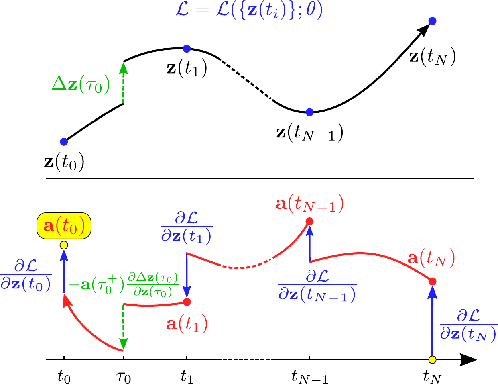

# Neural Jump Stochastic Differential Equations

This repository reproduces the original [implementation](https://github.com/000Justin000/torchdiffeq/tree/jj585) and is more efficient and supports gpu.
This implementation is based on the [code](https://github.com/facebookresearch/neural_stpp) released with [this](https://arxiv.org/abs/2011.04583) recent paper.

---

<p align="center">
  
</p>

## Setup

Dependencies:

- PyTorch 1.6+ (https://pytorch.org/)
- torchdiffeq 0.1.0+ (`pip install torchdiffeq`)

Run at the root of this repo:
```
python setup.py build_ext --inplace
```

## Data

Code to automatically download and preprocess most data sets can also be found in the `data` folder. Simply run
```
python download_and_preprocess_<data>.py
```
where `data` is one of `citibike|covid19|earthquakes`.

The BOLD5000 dataset requires manually downloading files from their [website](https://figshare.com/articles/dataset/BOLD5000/6459449). Specifically, the files satisfying `{}_Unfilt_BOLD_CSI1_Sess-{}_Run-{}` should be unzipped and placed in the `data/bold5000/` folder.

## Training
```
# data should be one of earthquakes_jp|fmri|citibikes|covid_nj_cases|pinwheel.
data=earthquakes_jp

# train a self-exciting baseline.
python train_stpp.py --data $data --model gmm --tpp hawkes

# train a time-varying CNF.
python train_stpp.py --data $data --model tvcnf

# train a Jump CNF.
python train_stpp.py --data $data --model jumpcnf --tpp neural --solve_reverse

# train an Attentive CNF.
python train_stpp.py --data $data --model attncnf --tpp neural --l2_attn
```

See additional arguments using `python train_stpp.py --help`.

# Citations
If you find this repository helpful in your publications,
please consider citing our paper.

```
@incollection{NIPS2019_9177,
title = {Neural Jump Stochastic Differential Equations},
author = {Jia, Junteng and Benson, Austin R},
booktitle = {Advances in Neural Information Processing Systems 32},
editor = {H. Wallach and H. Larochelle and A. Beygelzimer and F. d\textquotesingle Alch\'{e}-Buc and E. Fox and R. Garnett},
pages = {9847--9858},
year = {2019},
publisher = {Curran Associates, Inc.},
url = {http://papers.nips.cc/paper/9177-neural-jump-stochastic-differential-equations.pdf}
}

@inproceedings{chen2021neuralstpp,
title={Neural Spatio-Temporal Point Processes},
author={Ricky T. Q. Chen and Brandon Amos and Maximilian Nickel},
booktitle={International Conference on Learning Representations},
year={2021},
}
```

# Licensing
This repository is licensed under the
[CC BY-NC 4.0 License](https://creativecommons.org/licenses/by-nc/4.0/).
